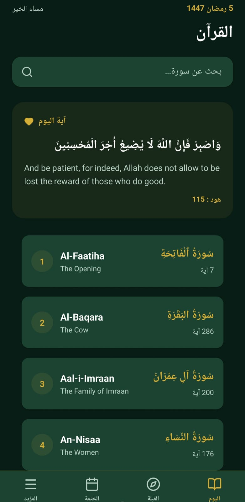

# 📖 Quran Premium (آيات)

[](https://expo.dev)
[](https://reactnative.dev)
[](https://www.typescriptlang.org/)
[](https://opensource.org/licenses/MIT)

Une application Coranique premium et riche en fonctionnalités, construite avec React Native et Expo. Conçue avec un accent particulier sur l'esthétique, la facilité d'utilisation et une expérience de lecture spirituelle.

<p align="center">
  <a href="https://github.com/mouad-kawmi/quran-app/releases/latest">
    
  </a>
</p>

<p align="center">
  
</p>

## ✨ Fonctionnalités

- **📜 Expérience de lecture hors ligne complète :** Téléchargez l'intégralité du Coran (par Sourate ou Juz) pour une lecture sans connexion internet.
- **📅 Suivi de Khatma Intelligent :** Plans de lecture personnalisables (3, 7, 10, 30 jours) avec synchronisation hors ligne de votre progression.
- **📜 Lecture Spirituelle :** Design premium avec des thèmes optimisés pour réduire la fatigue oculaire.
- **🕋 Boussole Qibla Précise :** Localisez la direction de la Mecque avec une boussole animée fluide et précise.
- **🕒 Horaires de Prière & Notifications :** Recevez des rappels pour chaque prière (y compris un rappel 5 minutes avant) qui se répètent quotidiennement.
- **☀️ Rappels d'Adhkar :** Notifications pour les Adhkar du matin et du soir.
- **🔍 Recherche Puissante :** Trouvez instantanément n'importe quel verset ou sourate.
- **🎧 Écoute Audio :** Récitation de haute qualité avec gestion intelligente du cache.
- **🌙 Thèmes Dynamiques :** Support complet du mode Clair (Parchemin) et du mode Sombre (Émeraude).

## 🛠️ Stack Technique

- **Framework :** React Native / Expo
- **Langage :** TypeScript
- **Style :** Vanilla CSS (Flexbox) pour une performance maximale
- **Icônes :** Lucide React Native
- **Stockage :** AsyncStorage avec mise en cache optimisée des données volumineuses
- **Notifications :** Expo Notifications (Triggers quotidiens répétitifs)
- **Déploiement :** EAS (Expo Application Services)

## 🚀 Mise en route

### Prérequis

- Node.js (v18+)
- Application Expo Go sur votre appareil physique

### Installation

1. Cloner le dépôt :
   ```bash
   git clone https://github.com/mouad-kawmi/quran-app.git
   ```

2. Installer les dépendances :
   ```bash
   npm install
   ```

3. Démarrer le serveur de développement :
   ```bash
   npx expo start
   ```

## 📦 Déploiement et Mises à jour

Cette application utilise **EAS Update** pour des mises à jour Over-The-Air (OTA).

- **Pour publier une mise à jour instantanée :**
  ```bash
  eas update --branch production --message "Mise à jour des fonctionnalités hors ligne"
  ```

---
Développé avec ❤️ pour la Ummah.
